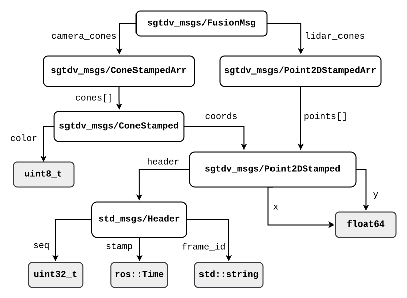
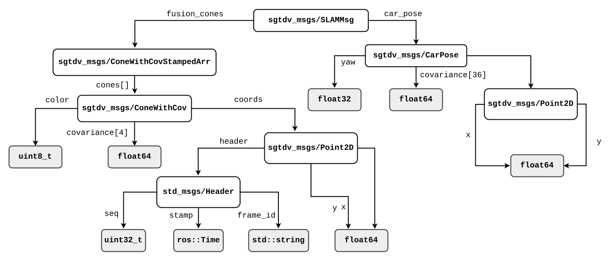
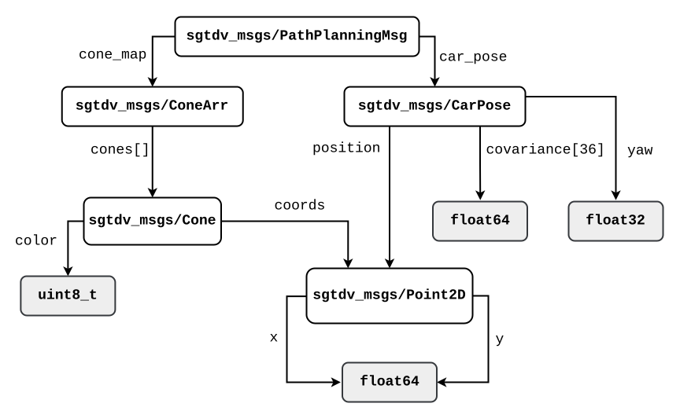
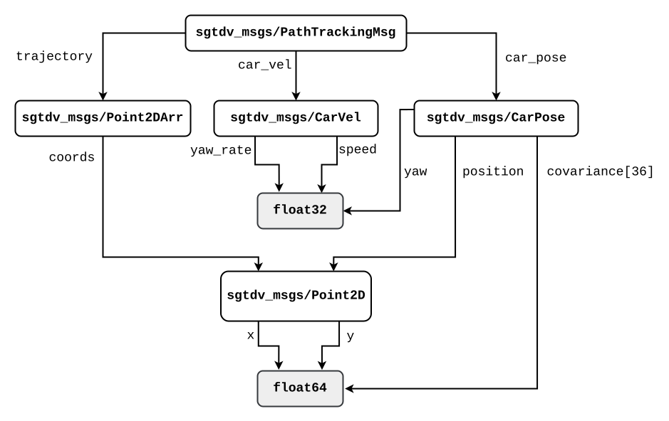

# **SGT-DV messages package**

___

© **SGT Driverless**

**Authors:** Juraj Krasňanský, Matúš Tomšík, Patrik Knaperek

**Objective:** Custom message and service types for SGT-DV ROS implementation.
___

In order to optimize the information flow between nodes and to send only data that we really need to be sent, we define custom message types (see `msg` folder).

## Combined messages decomposition

Below, decomposition of combined synchronization messages is showed. 

<figcaption align = "center">FusionMsg.msg message decomposition</figcaption>

  

<figcaption align = "center">SLAMMsg.msg message decomposition</figcaption>

  

<figcaption align = "center">PathPlanning.msg message decomposition</figcaption>

  

<figcaption align = "center">PathTracking.msg message decomposition</figcaption>

  

[**Keep up to date*](https://drive.google.com/file/d/1O1jDG0HykTuPU9wxy1FZ5LMXHLNu2jPT/view?usp=sharing)

## How to add new message types

Custom message files can contain fields of these types:
* int8, int16, int32, int64 (plus uint*)
* float32, float64
* string
* time, duration
* other msg files (e. g. pre-defined ROS types declared in `/opt/ros/<distro>/share/`)
* variable-length array[] and fixed-length array[C]

To build new message, service or action type:
1. Create new `.msg`/`.srv`/`.action` declaration file in the `msg/`/`/srv`/`/action` folder respectively
2. If any message field has a type from another message package, make sure
   1.  it's mentioned in `find_package(catkin REQUIRED COMPONENTS ...)`, `generate_messages(DEPENDENCIES ...)` and `catkin_package(CATKIN_DEPENDS ...)` groups of [CMakeLists.txt](./CMakeLists.txt) and 
   2.  has its `depend` tag line in [package.xml](./package.xml).
3. Add name of the new file in the [CMakeLists.txt](./CMakeLists.txt) in the `add_message_file()` group.
4. Build `sgtdv_msgs` package.
5. Include new header file in the [`sgtdv_msgs.cpp`](./src/sgtdv_msgs.cpp).